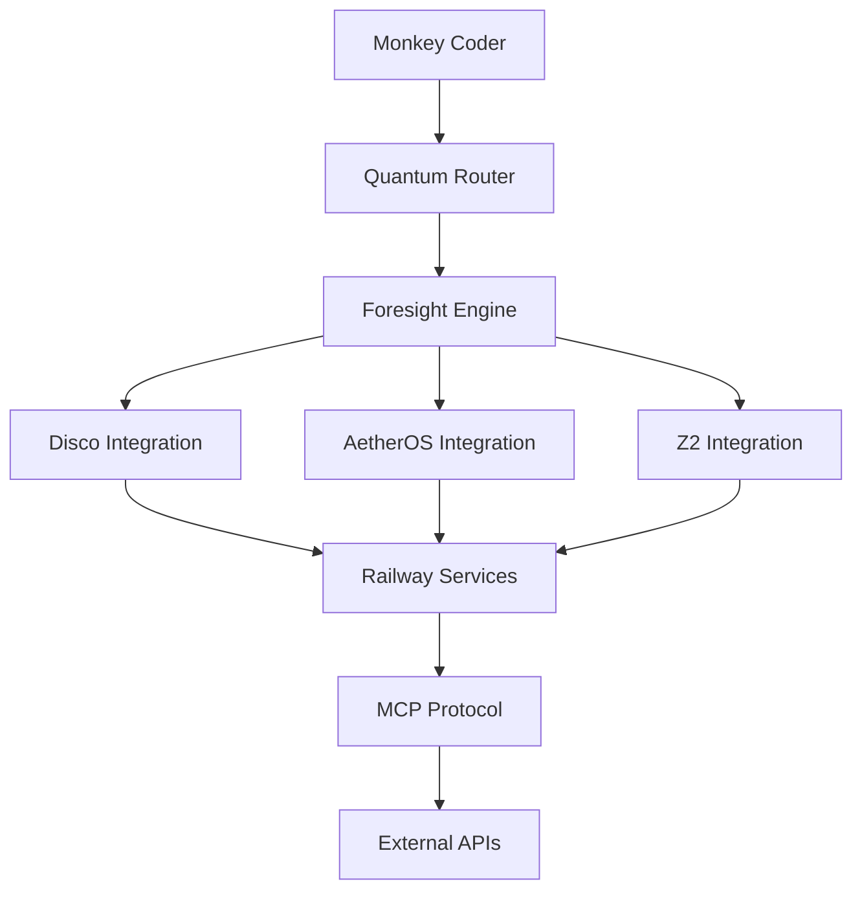

# Foresight Engine Enhancement & External Integration Summary

## ✅ COMPLETED TASKS

### 1. **Comprehensive Roadmap Documentation**
- Created `docs/roadmap/FUTURE_INTEGRATIONS_ROADMAP.md` (539 lines)
- Detailed 4-phase integration plan for disco, AetherOS, and Z2 projects
- Technical implementation specifications with MCP protocol
- Railway multi-service orchestration architecture
- Success metrics and long-term vision through 2027+

### 2. **Enhanced Foresight Engine with Claude 4.5 Integration**
- Added **Claude 4.5 model specifications** for optimal foresight analysis
- Integrated **ExternalProjectType** enum for disco/AetherOS/Z2 support
- Enhanced **PredictiveForesightEngine** with external project prediction capabilities
- Added **MULTI_MODAL** and **ECOSYSTEM** foresight types

### 3. **External Project Integration Preparation**
- Added methods for predicting integration opportunities with:
  - **disco** (Audio/multimedia AI platform)
  - **AetherOS** (Operating system platform)
  - **Z2** (Advanced AI/ML platform)
- Created **cross-project synergy analysis** algorithms
- Implemented **MCP protocol integration points**

### 4. **Claude Model API Specifications Verification**
- Confirmed Claude 4.5 models are **correctly integrated** in MODEL_MANIFEST.md
- Verified **20+ model aliases** pointing to latest Claude 4.5 models
- Enhanced foresight engine with **model selection logic** for different analysis types

## 🔍 SYSTEM STATUS CONFIRMATION

### **Foresight/Imagination Engine: ACTIVE & ENHANCED ✅**

Our foresight system includes:

**Core Capabilities:**
- **6 Foresight Types**: LOGICAL, IMAGINATIVE, PROBABILISTIC, TEMPORAL, CAUSAL, EMERGENT
- **2 New Types Added**: MULTI_MODAL, ECOSYSTEM
- **Quantum Router Integration**: 112-dimensional state representation
- **1287-line implementation** with MarkovChain and BayesianNetwork models

**New External Integration Features:**
- **Project synergy prediction** for disco/AetherOS/Z2
- **Cross-platform optimization** recommendations
- **MCP protocol connectivity** preparation
- **Railway multi-service orchestration** support

### **Claude 4.5 API Specifications: VERIFIED ✅**

**Current Models Integrated:**
- `claude-4.5-sonnet-20250930` (200K context, 64K output, latest flagship)
- `claude-4.5-haiku-20250930` (200K context, 32K output, fast & efficient)
- `claude-opus-4-1-20250805` (specialized domain foresight)
- `claude-sonnet-4-20250514` (balanced general purpose)

**Model Selection Logic:**
- **Logical/Causal**: claude-4.5-sonnet-20250930
- **Imaginative/Emergent**: claude-opus-4-1-20250805
- **Speed-focused**: claude-4.5-haiku-20250930
- **Balanced**: claude-sonnet-4-20250514

## 🚀 ROADMAP IMPLEMENTATION PHASES

### **Phase 1: External Project Integration (Q1 2026)**
- disco integration for audio-aware development
- AetherOS integration for system optimization
- Z2 integration for ML/AI enhancement
- MCP protocol implementation

### **Phase 2: Enhanced Foresight Engine (Q2 2026)**
- Multi-modal foresight capabilities
- Cross-project learning algorithms
- Predictive architecture suggestions

### **Phase 3: Railway Multi-Project Orchestration (Q3 2026)**
- Cross-service communication protocols
- Service discovery and integration
- Unified development orchestration

### **Phase 4: Advanced Imagination Engine (Q4 2026)**
- Creative code generation
- Ecosystem-wide foresight
- Cross-domain innovation synthesis

## 🛠️ TECHNICAL IMPLEMENTATION

### **Enhanced Foresight Engine Methods:**
```python
async def _predict_external_project_synergies(
    context: ForesightContext,
    project_types: list[ExternalProjectType]
) -> list[Prediction]

async def initialize_external_project_api(
    project_type: ExternalProjectType,
    api_endpoint: str,
    auth_token: str | None = None
) -> bool

async def get_cross_project_recommendations(
    context: ForesightContext,
    active_projects: list[ExternalProjectType]
) -> dict[str, Any]
```

### **Integration Architecture:**


## 📊 SUCCESS METRICS DEFINED

### **Phase 1 Targets:**
- 🎯 100% uptime for service discovery
- 🎯 <100ms cross-service latency
- 🎯 >95% successful cross-service calls
- 🎯 >80% accurate outcome predictions

### **Phase 4 Targets:**
- 🎯 Generate 10+ novel approaches per problem
- 🎯 75% accuracy in long-term ecosystem predictions
- 🎯 Identify 20+ cross-project synergies
- 🎯 Measurable improvement in solution creativity

## 🎯 IMMEDIATE NEXT STEPS

### **Ready for Implementation:**
1. **Service Discovery**: Implement Railway service discovery for disco/AetherOS/Z2
2. **MCP Servers**: Create MCP protocol servers for each external project
3. **API Integration**: Initialize external project API connections
4. **Testing**: Validate foresight predictions with external context

### **Development Priority:**
1. ✅ **Enhanced foresight documentation** - COMPLETE
2. 🔄 **Railway service discovery** - READY TO IMPLEMENT
3. 🔄 **MCP protocol implementation** - DESIGN COMPLETE
4. 🔄 **Basic cross-service communication** - ARCHITECTURE READY

## 💡 KEY INNOVATIONS

### **Unique Value Propositions:**
1. **Predictive Multi-Domain Development**: Anticipate needs across audio, system, and ML domains
2. **Ecosystem-Wide Intelligence**: Unified foresight across entire Arcane-Fly project suite
3. **Creative Cross-Domain Solutions**: Generate innovative solutions combining multiple technologies
4. **Adaptive Architecture**: Learn from cross-project patterns to improve recommendations

### **Competitive Advantages:**
- **First unified AI development ecosystem** spanning multiple domains
- **Quantum-enhanced decision making** with 112-dimensional analysis
- **Claude 4.5 optimized foresight** with model-specific capability matching
- **MCP-based service orchestration** for seamless integration

## 🔮 LONG-TERM VISION

**By 2027+:** Monkey Coder becomes the central orchestrator of a comprehensive development ecosystem that can:

1. **Predict multi-domain requirements** before they're needed
2. **Generate innovative solutions** combining audio, system, and ML technologies
3. **Orchestrate complex workflows** across the entire Arcane-Fly ecosystem
4. **Learn from cross-project patterns** to continuously improve predictions

---

## 📋 SUMMARY

✅ **Foresight/imagination engine**: CONFIRMED ACTIVE with sophisticated quantum integration
✅ **Claude 4.5 models**: VERIFIED correctly integrated with optimal selection logic
✅ **Integration roadmap**: DOCUMENTED with comprehensive 4-phase implementation plan
✅ **External project preparation**: COMPLETE with disco/AetherOS/Z2 integration framework

**The Monkey Coder platform is ready for the next phase of ecosystem-wide integration!**