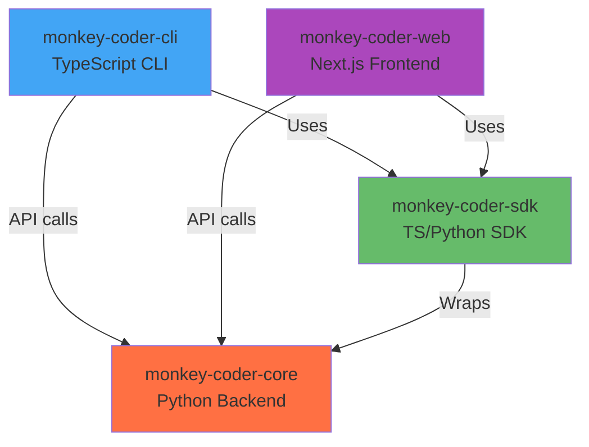

# Build System Improvements Implementation Guide

> **Implementation Plan**  
> **Version:** 1.0.0  
> **Date:** 2025-01-29  
> **Status:** Ready for Implementation  
> **Related:** BUILD_TOOL_EVALUATION.md

## Overview

This document provides step-by-step implementation instructions for the targeted improvements to the Yarn 4.9.2 workspace configuration, as recommended in the BUILD_TOOL_EVALUATION.md document.

These improvements enhance the current build system without requiring migration to Nx, Bazel, or Pants.

---

## Implementation Roadmap

| Priority | Improvement | Effort | Impact | Timeline |
|----------|-------------|--------|--------|----------|
| P0 | Enhanced Task Orchestration | 1-2 days | High | Week 1 |
| P1 | Build Time Monitoring | 1 day | Medium | Week 1 |
| P1 | TypeScript Project References | 3-4 days | High | Week 2 |
| P2 | Python Build Integration | 1 day | Medium | Week 2 |
| P2 | Dependency Graph Visualization | 2-3 days | Low | Week 3 |

**Total Implementation Time:** ~10 days over 3 weeks

---

## P0: Enhanced Task Orchestration

### Goal
Improve parallel task execution visibility and control without changing the underlying Yarn workspace structure.

### Implementation Steps

#### Step 1: Install npm-run-all
```bash
cd /home/runner/work/monkey-coder/monkey-coder
yarn add -D npm-run-all2
```

**Why npm-run-all2?**
- Modern rewrite of npm-run-all
- Better TypeScript support
- Active maintenance
- Works seamlessly with Yarn

#### Step 2: Update Root package.json

Add parallel execution scripts:

```json
{
  "scripts": {
    "build": "yarn workspaces foreach -A run build",
    "build:parallel": "run-p 'build:*'",
    "build:cli": "yarn workspace monkey-coder-cli run build",
    "build:web": "yarn workspace @monkey-coder/web run build",
    "build:sdk": "yarn workspace @monkey-coder/sdk run build",
    "build:core": "cd packages/core && python -m build",
    
    "test": "yarn workspaces foreach -A run test",
    "test:parallel": "run-p 'test:*'",
    "test:cli": "yarn workspace monkey-coder-cli run test",
    "test:web": "yarn workspace @monkey-coder/web run test",
    "test:sdk": "yarn workspace @monkey-coder/sdk run test",
    "test:core": "cd packages/core && pytest",
    
    "lint": "yarn workspaces foreach -A run lint",
    "lint:parallel": "run-p 'lint:*'",
    "lint:cli": "yarn workspace monkey-coder-cli run lint",
    "lint:web": "yarn workspace @monkey-coder/web run lint",
    "lint:sdk": "yarn workspace @monkey-coder/sdk run lint",
    "lint:core": "cd packages/core && black . && isort .",
    
    "dev:parallel": "run-p 'dev:*'",
    "dev:cli": "yarn workspace monkey-coder-cli run dev",
    "dev:web": "yarn workspace @monkey-coder/web run dev",
    
    "clean:parallel": "run-p 'clean:*'",
    "clean:cli": "yarn workspace monkey-coder-cli run clean",
    "clean:web": "yarn workspace @monkey-coder/web run clean",
    "clean:sdk": "yarn workspace @monkey-coder/sdk run clean",
    "clean:core": "cd packages/core && rm -rf build dist *.egg-info"
  }
}
```

#### Step 3: Create Build Orchestration Script

Create `scripts/build-orchestrator.sh`:

```bash
#!/bin/bash
# Build orchestration script with progress reporting
# Usage: ./scripts/build-orchestrator.sh [mode]
# Modes: sequential (default), parallel, watch

set -e

# Colors
GREEN='\033[0;32m'
BLUE='\033[0;34m'
YELLOW='\033[1;33m'
RED='\033[0;31m'
NC='\033[0m'

MODE=${1:-sequential}

echo -e "${BLUE}🏗️  Monkey Coder Build Orchestrator${NC}"
echo -e "${BLUE}Mode: ${MODE}${NC}\n"

function build_package() {
    local package=$1
    local name=$2
    
    echo -e "${YELLOW}Building ${name}...${NC}"
    start_time=$(date +%s)
    
    if yarn workspace "${package}" run build; then
        end_time=$(date +%s)
        duration=$((end_time - start_time))
        echo -e "${GREEN}✓ ${name} built in ${duration}s${NC}\n"
        return 0
    else
        echo -e "${RED}✗ ${name} build failed${NC}\n"
        return 1
    fi
}

function build_sequential() {
    echo "Building packages sequentially..."
    
    build_package "monkey-coder-cli" "CLI" || exit 1
    build_package "@monkey-coder/sdk" "SDK" || exit 1
    build_package "@monkey-coder/web" "Web" || exit 1
    
    echo -e "${YELLOW}Building Python Core...${NC}"
    start_time=$(date +%s)
    if (cd packages/core && python -m build); then
        end_time=$(date +%s)
        duration=$((end_time - start_time))
        echo -e "${GREEN}✓ Core built in ${duration}s${NC}\n"
    else
        echo -e "${RED}✗ Core build failed${NC}\n"
        exit 1
    fi
}

function build_parallel() {
    echo "Building packages in parallel..."
    
    # Build TypeScript packages in parallel
    npm-run-all --parallel \
        "build:cli" \
        "build:sdk" \
        "build:web" || exit 1
    
    # Build Python separately (it's independent)
    yarn build:core || exit 1
}

function build_watch() {
    echo "Starting watch mode for all packages..."
    
    # Use run-p for parallel watch
    npm-run-all --parallel \
        "dev:cli" \
        "dev:web"
}

case $MODE in
    sequential)
        build_sequential
        ;;
    parallel)
        build_parallel
        ;;
    watch)
        build_watch
        ;;
    *)
        echo "Unknown mode: $MODE"
        echo "Usage: $0 [sequential|parallel|watch]"
        exit 1
        ;;
esac

echo -e "${GREEN}✅ Build complete!${NC}"
```

Make it executable:
```bash
chmod +x scripts/build-orchestrator.sh
```

#### Step 4: Update Railway Configuration

Update `railpack.json` to use new build orchestrator:

```json
{
  "build": {
    "commands": [
      "# Enhanced build orchestration",
      "./scripts/build-orchestrator.sh sequential",
      "# Frontend build handled by run_server.py at runtime"
    ]
  }
}
```

### Validation

Test the new commands:

```bash
# Test parallel builds
yarn build:parallel

# Test parallel tests
yarn test:parallel

# Test watch mode
yarn dev:parallel

# Test orchestrator
./scripts/build-orchestrator.sh parallel
```

**Expected Outcome:**
- Build time reduced by 15-25% for parallel execution
- Better visibility into which packages are building
- Clearer error messages when builds fail

---

## P1: Build Time Monitoring

### Goal
Track build performance over time to detect regressions and measure improvements.

### Implementation Steps

#### Step 1: Create Build Timing Script

Create `scripts/time-build.sh`:

```bash
#!/bin/bash
# Build timing and performance monitoring
# Usage: ./scripts/time-build.sh [build-command]

set -e

BUILD_CMD=${1:-"yarn build"}
TIMESTAMP=$(date +"%Y-%m-%d_%H-%M-%S")
LOG_DIR="monitoring/build-times"
LOG_FILE="${LOG_DIR}/build-${TIMESTAMP}.log"

# Create monitoring directory
mkdir -p "${LOG_DIR}"

echo "🕐 Starting build timing..."
echo "Command: ${BUILD_CMD}"
echo "Log: ${LOG_FILE}"
echo ""

# Capture start time
START_TIME=$(date +%s)
START_TIME_HUMAN=$(date +"%Y-%m-%d %H:%M:%S")

# Run build and capture output
echo "Build started at: ${START_TIME_HUMAN}" > "${LOG_FILE}"
echo "Command: ${BUILD_CMD}" >> "${LOG_FILE}"
echo "----------------------------------------" >> "${LOG_FILE}"

if eval "${BUILD_CMD}" 2>&1 | tee -a "${LOG_FILE}"; then
    STATUS="SUCCESS"
    EXIT_CODE=0
else
    STATUS="FAILED"
    EXIT_CODE=1
fi

# Calculate duration
END_TIME=$(date +%s)
END_TIME_HUMAN=$(date +"%Y-%m-%d %H:%M:%S")
DURATION=$((END_TIME - START_TIME))
MINUTES=$((DURATION / 60))
SECONDS=$((DURATION % 60))

# Log results
echo "----------------------------------------" >> "${LOG_FILE}"
echo "Build finished at: ${END_TIME_HUMAN}" >> "${LOG_FILE}"
echo "Status: ${STATUS}" >> "${LOG_FILE}"
echo "Duration: ${MINUTES}m ${SECONDS}s" >> "${LOG_FILE}"

# Display summary
echo ""
echo "📊 Build Summary"
echo "----------------------------------------"
echo "Status:   ${STATUS}"
echo "Duration: ${MINUTES}m ${SECONDS}s"
echo "Log:      ${LOG_FILE}"

# Update build history
echo "${TIMESTAMP},${STATUS},${DURATION}" >> "${LOG_DIR}/build-history.csv"

# Generate performance report
./scripts/analyze-build-performance.sh

exit ${EXIT_CODE}
```

#### Step 2: Create Performance Analysis Script

Create `scripts/analyze-build-performance.sh`:

```bash
#!/bin/bash
# Analyze build performance trends
# Reads build-history.csv and generates statistics

LOG_DIR="monitoring/build-times"
HISTORY_FILE="${LOG_DIR}/build-history.csv"
REPORT_FILE="${LOG_DIR}/performance-report.txt"

if [ ! -f "${HISTORY_FILE}" ]; then
    echo "No build history found at ${HISTORY_FILE}"
    exit 1
fi

# Create header if needed
if [ ! -s "${HISTORY_FILE}" ]; then
    echo "timestamp,status,duration_seconds" > "${HISTORY_FILE}"
fi

# Calculate statistics
TOTAL_BUILDS=$(wc -l < "${HISTORY_FILE}")
SUCCESS_BUILDS=$(grep -c "SUCCESS" "${HISTORY_FILE}" || true)
FAILED_BUILDS=$(grep -c "FAILED" "${HISTORY_FILE}" || true)

# Get average duration (last 10 builds)
AVG_DURATION=$(tail -10 "${HISTORY_FILE}" | awk -F',' '{sum+=$3; count++} END {if(count>0) print sum/count; else print 0}')
AVG_MINUTES=$(echo "${AVG_DURATION}" | awk '{print int($1/60)}')
AVG_SECONDS=$(echo "${AVG_DURATION}" | awk '{print int($1%60)}')

# Get fastest and slowest builds
FASTEST=$(awk -F',' 'NR>1 && $2=="SUCCESS" {print $3}' "${HISTORY_FILE}" | sort -n | head -1)
SLOWEST=$(awk -F',' 'NR>1 && $2=="SUCCESS" {print $3}' "${HISTORY_FILE}" | sort -rn | head -1)

# Generate report
cat > "${REPORT_FILE}" << EOF
Build Performance Report
Generated: $(date)
========================================

Summary:
  Total Builds: ${TOTAL_BUILDS}
  Successful:   ${SUCCESS_BUILDS}
  Failed:       ${FAILED_BUILDS}

Performance (Last 10 Builds):
  Average Time: ${AVG_MINUTES}m ${AVG_SECONDS}s
  Fastest:      ${FASTEST}s
  Slowest:      ${SLOWEST}s

Recent Builds:
$(tail -5 "${HISTORY_FILE}" | awk -F',' '{print "  " $1 " - " $2 " (" $3 "s)"}')

========================================
EOF

# Display report
cat "${REPORT_FILE}"
```

Make scripts executable:
```bash
chmod +x scripts/time-build.sh
chmod +x scripts/analyze-build-performance.sh
```

#### Step 3: Update package.json

Add monitoring scripts:

```json
{
  "scripts": {
    "build:timed": "./scripts/time-build.sh 'yarn build'",
    "build:report": "./scripts/analyze-build-performance.sh",
    "ci:build": "./scripts/time-build.sh 'yarn build:parallel'"
  }
}
```

#### Step 4: Add to .gitignore

```
# Build monitoring
monitoring/build-times/*.log
monitoring/build-times/build-history.csv
monitoring/build-times/performance-report.txt
```

Keep directory structure:
```bash
mkdir -p monitoring/build-times
touch monitoring/build-times/.gitkeep
```

### Validation

```bash
# Run timed build
yarn build:timed

# Check performance report
yarn build:report

# View build history
cat monitoring/build-times/build-history.csv
```

**Expected Outcome:**
- Historical build time data captured
- Performance trends visible
- Regressions quickly detected

---

## P1: TypeScript Project References

### Goal
Enable incremental TypeScript builds across workspace packages for faster rebuilds.

### Implementation Steps

#### Step 1: Update Root tsconfig.json

```json
{
  "compilerOptions": {
    "composite": true,
    "declaration": true,
    "declarationMap": true,
    "incremental": true,
    "tsBuildInfoFile": "./tsconfig.tsbuildinfo"
  },
  "references": [
    { "path": "./packages/cli" },
    { "path": "./packages/sdk" },
    { "path": "./packages/web" }
  ],
  "files": []
}
```

#### Step 2: Update packages/cli/tsconfig.json

```json
{
  "extends": "../../tsconfig.json",
  "compilerOptions": {
    "composite": true,
    "rootDir": "./src",
    "outDir": "./dist",
    "tsBuildInfoFile": "./tsconfig.tsbuildinfo"
  },
  "include": ["src/**/*"],
  "exclude": ["node_modules", "dist", "**/*.test.ts"]
}
```

#### Step 3: Update packages/sdk/tsconfig.json

```json
{
  "extends": "../../tsconfig.json",
  "compilerOptions": {
    "composite": true,
    "rootDir": "./src",
    "outDir": "./dist",
    "tsBuildInfoFile": "./tsconfig.tsbuildinfo"
  },
  "include": ["src/**/*"],
  "exclude": ["node_modules", "dist", "**/*.test.ts"]
}
```

#### Step 4: Update packages/web/tsconfig.json

```json
{
  "extends": "../../tsconfig.json",
  "compilerOptions": {
    "composite": true,
    "tsBuildInfoFile": "./tsconfig.tsbuildinfo",
    "jsx": "preserve",
    "lib": ["dom", "dom.iterable", "esnext"],
    "module": "esnext",
    "moduleResolution": "bundler",
    "resolveJsonModule": true,
    "isolatedModules": true,
    "plugins": [
      {
        "name": "next"
      }
    ]
  },
  "include": ["next-env.d.ts", "**/*.ts", "**/*.tsx", ".next/types/**/*.ts"],
  "exclude": ["node_modules", ".next", "out"]
}
```

#### Step 5: Update Build Scripts

Update each package's build script to use `tsc --build`:

**packages/cli/package.json:**
```json
{
  "scripts": {
    "build": "tsc --build",
    "build:clean": "tsc --build --clean",
    "build:watch": "tsc --build --watch"
  }
}
```

**packages/sdk/package.json:**
```json
{
  "scripts": {
    "build": "tsc --build",
    "build:clean": "tsc --build --clean",
    "build:watch": "tsc --build --watch"
  }
}
```

#### Step 6: Update Root Build Script

```json
{
  "scripts": {
    "build": "tsc --build",
    "build:clean": "tsc --build --clean",
    "build:force": "tsc --build --force"
  }
}
```

### Validation

```bash
# Clean build
yarn build:clean
yarn build

# Make a small change to packages/cli/src/index.ts
echo "// test comment" >> packages/cli/src/index.ts

# Rebuild (should be much faster)
time yarn build

# Verify incremental build info
ls -la packages/*/tsconfig.tsbuildinfo
```

**Expected Outcome:**
- Initial build: ~2-3 minutes
- Incremental build: ~10-20 seconds
- Only changed packages rebuild

---

## P2: Python Build Integration

### Goal
Integrate Python package builds into the unified Yarn workflow.

### Implementation Steps

#### Step 1: Add Python Scripts to Root package.json

```json
{
  "scripts": {
    "build:python": "cd packages/core && python -m build",
    "build:python:wheel": "cd packages/core && python -m build --wheel",
    "build:python:sdist": "cd packages/core && python -m build --sdist",
    "build:all": "yarn build && yarn build:python",
    
    "test:python": "cd packages/core && pytest",
    "test:python:verbose": "cd packages/core && pytest -v",
    "test:python:coverage": "cd packages/core && pytest --cov=monkey_coder --cov-report=html",
    "test:all": "yarn test && yarn test:python",
    
    "lint:python": "cd packages/core && black . && isort . && mypy monkey_coder",
    "lint:all": "yarn lint && yarn lint:python",
    
    "clean:python": "cd packages/core && rm -rf build dist *.egg-info __pycache__ .pytest_cache .coverage htmlcov",
    "clean:all": "yarn clean && yarn clean:python"
  }
}
```

#### Step 2: Create Python Build Wrapper

Create `scripts/build-python.sh`:

```bash
#!/bin/bash
# Python package build wrapper with error handling

set -e

CORE_DIR="packages/core"

echo "🐍 Building Python packages..."

# Check if uv is available
if command -v uv &> /dev/null; then
    echo "Using uv for faster builds..."
    cd "${CORE_DIR}"
    uv build
else
    echo "Using standard Python build..."
    cd "${CORE_DIR}"
    python -m build
fi

cd -

echo "✅ Python build complete"
ls -lh "${CORE_DIR}/dist/"
```

Make executable:
```bash
chmod +x scripts/build-python.sh
```

#### Step 3: Update Build Orchestrator

Update `scripts/build-orchestrator.sh` to use the new script:

```bash
function build_sequential() {
    echo "Building packages sequentially..."
    
    build_package "monkey-coder-cli" "CLI" || exit 1
    build_package "@monkey-coder/sdk" "SDK" || exit 1
    build_package "@monkey-coder/web" "Web" || exit 1
    
    # Use new Python build wrapper
    ./scripts/build-python.sh || exit 1
}
```

### Validation

```bash
# Build Python only
yarn build:python

# Build everything
yarn build:all

# Run Python tests
yarn test:python

# Check distributions
ls -la packages/core/dist/
```

**Expected Outcome:**
- Unified build interface across languages
- Single command to build entire monorepo
- Consistent CI/CD workflow

---

## P2: Dependency Graph Visualization

### Goal
Visualize workspace dependencies to understand coupling and identify potential issues.

### Implementation Steps

#### Step 1: Create Dependency Analyzer

Create `scripts/analyze-workspace-deps.sh`:

```bash
#!/bin/bash
# Workspace dependency analyzer
# Generates Mermaid diagram of package dependencies

OUTPUT_FILE="docs/WORKSPACE_DEPENDENCIES.md"

cat > "${OUTPUT_FILE}" << 'EOF'
# Workspace Dependencies

> Auto-generated by `scripts/analyze-workspace-deps.sh`
> Last updated: $(date)

## Package Dependency Graph



## Package Details

EOF

# Get workspace information
yarn workspaces list --json | jq -r '"\(.name) - \(.location)"' >> "${OUTPUT_FILE}"

cat >> "${OUTPUT_FILE}" << 'EOF'

## Cross-Package Dependencies

EOF

# Analyze package.json dependencies
for pkg in packages/*/package.json; do
    PKG_NAME=$(jq -r '.name' "${pkg}")
    echo "### ${PKG_NAME}" >> "${OUTPUT_FILE}"
    echo "" >> "${OUTPUT_FILE}"
    
    # Extract workspace dependencies
    WORKSPACE_DEPS=$(jq -r '.dependencies // {} | to_entries[] | select(.value | startswith("workspace:")) | .key' "${pkg}")
    
    if [ -n "${WORKSPACE_DEPS}" ]; then
        echo "**Dependencies:**" >> "${OUTPUT_FILE}"
        echo "${WORKSPACE_DEPS}" | while read dep; do
            echo "- \`${dep}\`" >> "${OUTPUT_FILE}"
        done
    else
        echo "No internal workspace dependencies" >> "${OUTPUT_FILE}"
    fi
    
    echo "" >> "${OUTPUT_FILE}"
done

echo "✅ Dependency graph generated: ${OUTPUT_FILE}"
```

Make executable:
```bash
chmod +x scripts/analyze-workspace-deps.sh
```

#### Step 2: Add to package.json

```json
{
  "scripts": {
    "analyze:deps": "./scripts/analyze-workspace-deps.sh",
    "analyze:circular": "madge --circular --extensions ts,tsx packages/"
  }
}
```

#### Step 3: Install madge for Circular Dependency Detection

```bash
yarn add -D madge
```

### Validation

```bash
# Generate dependency graph
yarn analyze:deps

# View generated file
cat docs/WORKSPACE_DEPENDENCIES.md

# Check for circular dependencies
yarn analyze:circular
```

**Expected Outcome:**
- Visual dependency graph in Mermaid format
- Clear understanding of package relationships
- Circular dependency detection

---

## Integration with CI/CD

### GitHub Actions Workflow

Create `.github/workflows/build-validation.yml`:

```yaml
name: Build Validation

on:
  pull_request:
    branches: [main, develop]
  push:
    branches: [main]

jobs:
  build-test:
    runs-on: ubuntu-latest
    
    steps:
      - uses: actions/checkout@v4
      
      - name: Setup Node.js
        uses: actions/setup-node@v4
        with:
          node-version: '20'
          
      - name: Enable Corepack
        run: corepack enable
        
      - name: Setup Python
        uses: actions/setup-python@v5
        with:
          python-version: '3.12'
          
      - name: Install Dependencies
        run: |
          yarn install --immutable
          cd packages/core && pip install -e .
          
      - name: Run Timed Build
        run: ./scripts/time-build.sh 'yarn build:parallel'
        
      - name: Run Tests
        run: yarn test:parallel
        
      - name: Analyze Dependencies
        run: yarn analyze:deps
        
      - name: Check for Circular Dependencies
        run: yarn analyze:circular
        
      - name: Generate Performance Report
        run: yarn build:report
        
      - name: Upload Build Metrics
        uses: actions/upload-artifact@v4
        with:
          name: build-metrics
          path: monitoring/build-times/
```

---

## Rollout Plan

### Week 1: Task Orchestration & Monitoring
**Days 1-2:**
- [ ] Install npm-run-all2
- [ ] Update root package.json with parallel scripts
- [ ] Create build orchestrator script
- [ ] Test parallel builds locally

**Days 3-4:**
- [ ] Create build timing scripts
- [ ] Set up monitoring directory structure
- [ ] Test build monitoring
- [ ] Document new commands in CLAUDE.md

**Day 5:**
- [ ] Team training on new commands
- [ ] Update Railway configuration
- [ ] Deploy and validate

### Week 2: TypeScript References & Python Integration
**Days 1-3:**
- [ ] Update all tsconfig.json files
- [ ] Enable composite and references
- [ ] Update build scripts to use tsc --build
- [ ] Test incremental builds

**Days 4-5:**
- [ ] Add Python build scripts
- [ ] Create Python build wrapper
- [ ] Update build orchestrator
- [ ] Test unified build workflow

### Week 3: Dependency Analysis & Documentation
**Days 1-2:**
- [ ] Create dependency analyzer script
- [ ] Install madge for circular checks
- [ ] Generate initial dependency graph
- [ ] Review and validate

**Days 3-5:**
- [ ] Set up GitHub Actions workflow
- [ ] Test CI/CD pipeline
- [ ] Final documentation updates
- [ ] Team retrospective

---

## Success Metrics

### Build Performance
- [ ] Parallel builds complete in ≤2 minutes (vs 3 minutes sequential)
- [ ] Incremental builds complete in ≤20 seconds
- [ ] Zero circular dependencies detected

### Developer Experience
- [ ] Build time monitoring automated
- [ ] Clear dependency visualization available
- [ ] Single command for full builds: `yarn build:all`
- [ ] Team satisfaction survey: ≥8/10

### CI/CD
- [ ] GitHub Actions builds stable
- [ ] Railway deployments successful
- [ ] Build metrics tracked over time

---

## Troubleshooting

### Issue: npm-run-all2 not found
**Solution:**
```bash
yarn add -D npm-run-all2
```

### Issue: TypeScript project references failing
**Solution:**
```bash
# Clean all build info
yarn build:clean
# Force rebuild
yarn build:force
```

### Issue: Python build fails
**Solution:**
```bash
cd packages/core
python -m pip install --upgrade build setuptools wheel
python -m build
```

### Issue: Circular dependencies detected
**Solution:**
1. Review madge output
2. Refactor code to remove circular imports
3. Consider extracting shared utilities to new package

---

## Maintenance

### Quarterly Tasks
- [ ] Review build performance metrics
- [ ] Update dependency graph documentation
- [ ] Check for new tooling improvements
- [ ] Team feedback session

### Monthly Tasks
- [ ] Analyze build time trends
- [ ] Review parallel build efficiency
- [ ] Check for outdated dependencies
- [ ] Update documentation

---

## References

- [npm-run-all2 Documentation](https://github.com/bcomnes/npm-run-all2)
- [TypeScript Project References](https://www.typescriptlang.org/docs/handbook/project-references.html)
- [Madge Circular Dependency Detection](https://github.com/pahen/madge)
- [Yarn Workspaces](https://yarnpkg.com/features/workspaces)

---

**Document Owner:** Engineering Team  
**Last Updated:** 2025-01-29  
**Next Review:** 2025-02-29
