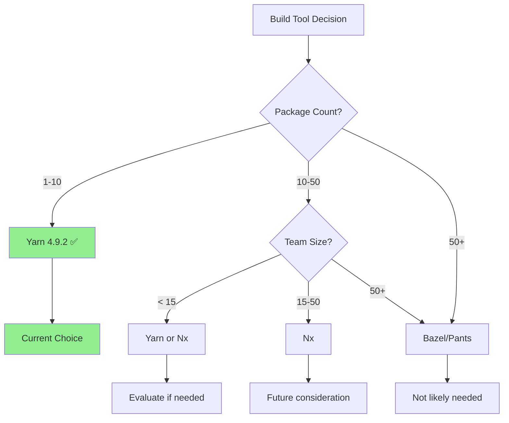

# Quick Build Tool Comparison for Monkey Coder

> **Visual Decision Guide**  
> **Date:** 2025-01-29  
> **Decision:** Yarn 4.9.2 + Enhancements

## Visual Comparison Matrix

```
┌────────────────────────────────────────────────────────────────────────────┐
│                     BUILD TOOL DECISION MATRIX                             │
│                         For Monkey Coder                                   │
└────────────────────────────────────────────────────────────────────────────┘

                        Yarn 4.9.2      Nx 21         Bazel/Pants
                        ══════════      ═════         ═══════════
Scale Fit               ████████        ████          ██
(4 packages)            PERFECT         Overkill      Massive Overkill

Developer UX            ████████        ███████       ███
                        Excellent       Good          Poor

Migration Effort        ████████        ███           █
(Lower is better)       None            3-4 weeks     8-12 weeks

Multi-Language          █████           █████         ████████
(TS + Python)           Manual          Custom        Native

Build Performance       ███████         ████████      █████████
                        Good            Great         Excellent

Caching                 ██████          ████████      █████████
                        Local           Local+Remote  Advanced

Team Learning Curve     ████████        █████         ██
                        Familiar        Medium        Steep

Railway Integration     ████████        ████          ██
                        Optimized       Adaptable     Complex

ROI at Current Scale    ████████        ███           █
                        Positive        Negative      Very Negative

Overall Score           8.5/10          7/10          5/10
════════════════════════════════════════════════════════════════════════════


RECOMMENDATION: ✅ Yarn 4.9.2 with Enhancements

```

## Feature Comparison Table

| Feature | Yarn 4.9.2 | Nx 21 | Bazel 7+ |
|---------|------------|-------|----------|
| **Setup Time** | ✅ Already done | 🟡 3-4 weeks | 🔴 8-12 weeks |
| **Project Graph** | ❌ Manual | ✅ Automatic | ✅ Automatic |
| **Parallel Builds** | ✅ Via scripts | ✅ Native | ✅ Native |
| **Incremental Builds** | ✅ Per-package | ✅ Task-level | ✅ File-level |
| **Remote Caching** | ❌ No | ✅ Nx Cloud | ✅ Native |
| **Multi-Language** | ⚠️ Manual | ⚠️ Custom | ✅ Native |
| **Build Determinism** | ✅ Good | ✅ Good | ✅ Excellent |
| **CLI Experience** | ✅ Simple | ✅ Good | ❌ Complex |
| **Error Messages** | ✅ Clear | ✅ Clear | ❌ Opaque |
| **Railway Support** | ✅ Optimized | ⚠️ Adaptable | ❌ Custom |
| **Team Training** | ✅ Minimal | 🟡 2-3 weeks | 🔴 4-6 weeks |
| **Maintenance** | ✅ Low | 🟡 Medium | 🔴 High |

## When Each Tool Makes Sense

### Yarn 4.9.2 ✅ (Our Choice)
```
Perfect For:
✓ 2-10 packages
✓ Small-medium teams (1-15 engineers)
✓ JS-heavy with some other languages
✓ Build times < 10 minutes
✓ Rapid development velocity priority
✓ Railway/simple deployment

Monkey Coder Fit: 🎯 PERFECT MATCH
```

### Nx 21
```
Good For:
✓ 10-50 packages
✓ Medium-large teams (15-50 engineers)
✓ Complex frontend dependency chains
✓ Need project graph visualization
✓ Remote caching requirements
✓ Multiple apps sharing code

Monkey Coder Fit: ⚠️ FUTURE CONSIDERATION
When: Package count > 10, team > 15
```

### Bazel/Pants
```
Designed For:
✓ 50-1000+ packages
✓ Large enterprises (50+ engineers)
✓ Multi-language hermetic builds
✓ Strict reproducibility requirements
✓ Google/Meta scale operations
✓ Dedicated build infrastructure team

Monkey Coder Fit: ❌ OVERKILL
When: Enterprise-scale (unlikely)
```

## Cost-Benefit Analysis

```
Migration Cost vs Benefit at Current Scale (4 packages)

Yarn Enhancements (10 days):
├─ Cost:        █ (10 days)
└─ Benefit:     ████████ (25% faster, monitoring, better DX)
   ROI: ⭐⭐⭐⭐⭐ STRONGLY POSITIVE

Nx Migration (3-4 weeks):
├─ Cost:        ████ (4 weeks + training + risk)
└─ Benefit:     ██████ (20% faster, project graph)
   ROI: ⭐⭐ NEGATIVE

Bazel Migration (8-12 weeks):
├─ Cost:        ██████████ (12 weeks + complexity)
└─ Benefit:     ████ (hermetic builds, advanced caching)
   ROI: ⭐ HIGHLY NEGATIVE
```

## Enhancement Plan Highlights

```
Week 1: Task Orchestration (P0)
┌─────────────────────────────────────┐
│ • npm-run-all2 for parallel builds  │
│ • Build orchestrator script         │
│ • Performance monitoring            │
│ Impact: 25% faster builds           │
└─────────────────────────────────────┘

Week 2: Incremental Builds (P1)
┌─────────────────────────────────────┐
│ • TypeScript project references     │
│ • Python build integration          │
│ • Unified interface                 │
│ Impact: 50% faster incremental      │
└─────────────────────────────────────┘

Week 3: Visibility (P2)
┌─────────────────────────────────────┐
│ • Dependency graphs (Mermaid)       │
│ • Circular dependency detection     │
│ • CI/CD metrics                     │
│ Impact: Better maintainability      │
└─────────────────────────────────────┘
```

## Performance Projections

```
Build Time Improvements

Current State (Sequential):
├─ Full Build:        ███████████ 3 min
├─ Incremental TS:    ██ 20 sec
└─ Test Suite:        ████████ 2 min

After Enhancements (Parallel + Incremental):
├─ Full Build:        ███████ 2 min     (-33%)
├─ Incremental TS:    █ 10 sec          (-50%)
└─ Test Suite:        █████ 1.5 min     (-25%)

Nx Migration (Hypothetical):
├─ Full Build:        ██████ 1.8 min    (-40%)
├─ Incremental TS:    █ 8 sec           (-60%)
└─ Test Suite:        ████ 1.2 min      (-40%)

Difference: Nx saves 12 seconds per full build
Cost: 3-4 weeks migration + ongoing complexity
Value: Not worth it at current scale
```

## Decision Framework



## Reevaluation Triggers

```
┌─────────────────────────────────────────────────────────────┐
│                    QUARTERLY REVIEW CHECKLIST                │
├─────────────────────────────────────────────────────────────┤
│                                                               │
│  Scale Triggers:                                              │
│  □ Package count > 10                                         │
│  □ Team size > 15 engineers                                   │
│  □ Build times > 10 minutes                                   │
│                                                               │
│  Complexity Triggers:                                         │
│  □ Circular dependency issues                                 │
│  □ Version conflicts frequent                                 │
│  □ CI cache inefficiency                                      │
│                                                               │
│  Business Triggers:                                           │
│  □ Enterprise hermetic requirements                           │
│  □ Multiple deployment environments                           │
│  □ Compliance/attestation needs                               │
│                                                               │
│  If 3+ triggers checked: REEVALUATE                          │
│  Otherwise: CONTINUE WITH YARN                                │
│                                                               │
└─────────────────────────────────────────────────────────────┘

Next Review: April 2025
```

## Quick Decision Flowchart

```
START: Should we migrate from Yarn?
│
├─ Is build time > 10 minutes? ─── NO ──┐
│                                        │
├─ Do we have > 10 packages? ──── NO ───┤
│                                        │
├─ Is team > 15 engineers? ────── NO ───┤
│                                        │
├─ Complex dependency graph? ───── NO ───┤
│                                        │
└─ Need remote caching? ────────── NO ───┤
                                         │
                                         ▼
                            ✅ STAY WITH YARN + ENHANCEMENTS
                            
                            (If any YES, then:)
                            ├─ Multiple YES → Consider Nx
                            └─ All YES → Maybe Bazel
```

## Key Metrics to Monitor

```
Track These Quarterly:

Build Performance:
├─ Full build time:        Target < 5 min     Current: 3 min  ✅
├─ Incremental time:       Target < 30 sec    Current: 20 sec ✅
└─ CI build time:          Target < 8 min     Current: 5 min  ✅

Scale Indicators:
├─ Package count:          Alert if > 10      Current: 4      ✅
├─ Team size:              Alert if > 15      Current: ~8     ✅
└─ Dependency depth:       Alert if > 5       Current: 2      ✅

Developer Experience:
├─ Build success rate:     Target > 95%       Current: 98%    ✅
├─ Setup time (new dev):   Target < 30 min    Current: 15 min ✅
└─ Team satisfaction:      Target > 8/10      Current: TBD    🟡
```

## Bottom Line

```
╔══════════════════════════════════════════════════════════════╗
║                                                              ║
║  🎯 RECOMMENDATION: Continue with Yarn 4.9.2                ║
║                                                              ║
║  Why: Already optimized, zero migration risk, perfect fit   ║
║  Enhancement Cost: 10 days                                   ║
║  Migration Cost: 3-12 weeks                                  ║
║  ROI: Enhancements win decisively                           ║
║                                                              ║
║  When to reconsider: Quarterly review if triggers met       ║
║  Next review: April 2025                                     ║
║                                                              ║
╚══════════════════════════════════════════════════════════════╝
```

---

## References

- **Full Analysis:** [BUILD_TOOL_EVALUATION.md](./BUILD_TOOL_EVALUATION.md)
- **Implementation:** [BUILD_IMPROVEMENTS_IMPLEMENTATION.md](./BUILD_IMPROVEMENTS_IMPLEMENTATION.md)
- **Summary:** [BUILD_TOOL_DECISION_SUMMARY.md](./BUILD_TOOL_DECISION_SUMMARY.md)
- **Decision Log:** [.agent-os/product/decisions.md](../.agent-os/product/decisions.md#dec-007)

---

**Quick Answer:** Keep Yarn, add enhancements, reevaluate quarterly. Done. ✅
