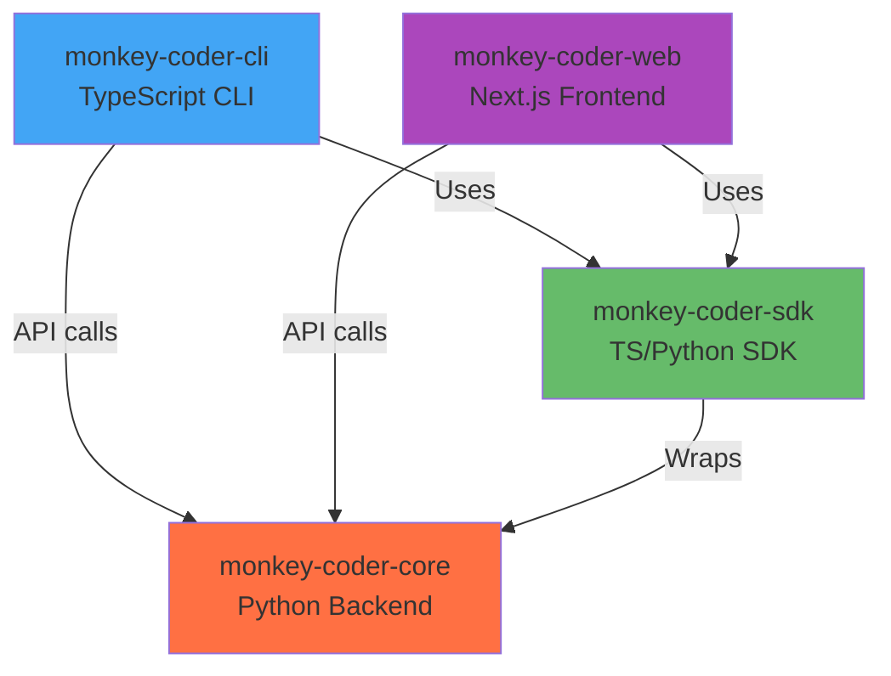

# Workspace Dependencies

> Auto-generated by `scripts/analyze-workspace-deps.sh`
> Last updated: $(date)

## Package Dependency Graph

## Package Details

monkey-coder - .
docs - docs
monkey-coder-cli - packages/cli
monkey-coder-sdk - packages/sdk
@monkey-coder/web - packages/web

## Cross-Package Dependencies

### monkey-coder-cli

No internal workspace dependencies

### monkey-coder-sdk

No internal workspace dependencies

### @monkey-coder/web

No internal workspace dependencies
