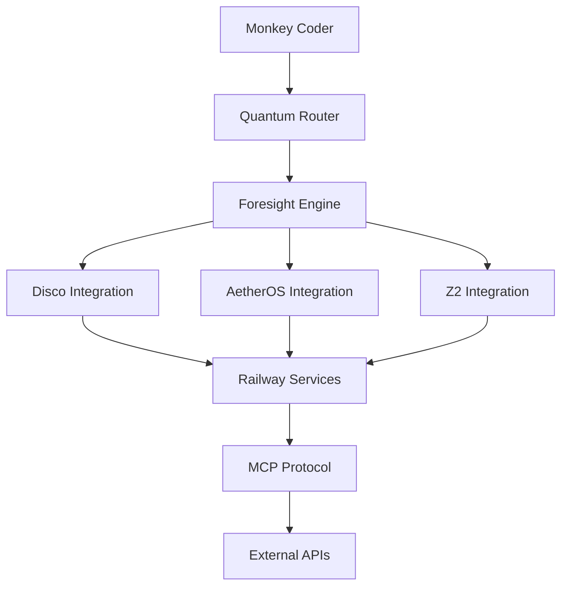

# Future Integrations Roadmap - Monkey Coder Platform

## Executive Summary

This document outlines the strategic roadmap for integrating external projects and enhancing the foresight/imagination engine within the Monkey Coder platform. The roadmap focuses on building a comprehensive AI-powered development ecosystem.

## Current Foresight/Imagination System Status ✅

### **Existing Capabilities**

Our **Predictive Foresight Engine** (`packages/core/monkey_coder/foresight/predictive_engine.py`) includes:

1. **Multi-Type Foresight Analysis**:
   - `LOGICAL` - Based on known factors
   - `IMAGINATIVE` - Creative extrapolation
   - `PROBABILISTIC` - Statistical prediction
   - `TEMPORAL` - Time-based evolution
   - `CAUSAL` - Cause-effect chains
   - `EMERGENT` - Emergent patterns

2. **Quantum Router Integration** (`packages/core/monkey_coder/core/quantum_routing.py`):
   - 112-dimensional state representation
   - Advanced complexity analysis
   - Enhanced provider performance tracking
   - User preference learning
   - Resource constraint awareness

3. **Key Methods**:
   ```python
   async def generate_foresight(
       self,
       context: ForesightContext,
       enable_imagination: bool = True
   ) -> Dict[str, Any]:
       """Generate comprehensive foresight analysis"""

   async def imagine_future_possibilities(
       self,
       context: Dict[str, Any],
       num_possibilities: int = 10,
       creativity_level: float = 0.7
   ) -> List[Dict[str, Any]]:
       """Imagine creative future possibilities"""
   ```

### **How It Currently Works**

The foresight system operates as an **extension of the quantum router**:

1. **User Intent Analysis**: Contextualizes prompts with codebase and documentation
2. **Outcome Prediction**: Generates multiple possible outcomes using various foresight types
3. **Probability Assessment**: Evaluates likelihood and confidence for each outcome
4. **Optimal Path Selection**: Chooses best direction using quantum-enhanced analysis

## 🚀 Phase 1: External Project Integration (Q1 2026)

### 1.1 Disco Integration (Music/Audio AI)
**Target**: https://github.com/Arcane-Fly/disco.git

**Integration Approach**:
```python
class DiscoIntegration:
    """Integration with Disco music/audio AI system"""

    async def integrate_audio_capabilities(
        self,
        context: Dict[str, Any]
    ) -> Dict[str, Any]:
        """Add audio generation/analysis to foresight"""

    async def predict_audio_requirements(
        self,
        code_context: Dict[str, Any]
    ) -> List[str]:
        """Predict when audio features might be needed"""
```

**Use Cases**:
- Audio-enabled applications development
- Music generation for game development
- Sound effect integration prediction
- Audio processing algorithm recommendations

### 1.2 AetherOS Integration (Operating System)
**Target**: https://github.com/Arcane-Fly/AetherOS.git

**Integration Approach**:
```python
class AetherOSIntegration:
    """Integration with AetherOS operating system"""

    async def predict_os_requirements(
        self,
        application_context: Dict[str, Any]
    ) -> Dict[str, Any]:
        """Predict OS-level requirements and optimizations"""

    async def suggest_system_architecture(
        self,
        project_scope: Dict[str, Any]
    ) -> List[Dict[str, Any]]:
        """Suggest system-level architecture patterns"""
```

**Use Cases**:
- System-level programming assistance
- OS performance optimization
- Hardware-specific code generation
- Low-level API integration

### 1.3 Z2 Integration (Advanced AI/ML Platform)
**Target**: https://github.com/Arcane-Fly/Z2.git

**Integration Approach**:
```python
class Z2Integration:
    """Integration with Z2 AI/ML platform"""

    async def enhance_ml_predictions(
        self,
        context: Dict[str, Any]
    ) -> Dict[str, Any]:
        """Enhance ML-specific foresight capabilities"""

    async def predict_model_architecture(
        self,
        data_requirements: Dict[str, Any]
    ) -> List[str]:
        """Predict optimal ML model architectures"""
```

**Use Cases**:
- ML/AI project development
- Model architecture recommendations
- Training pipeline optimization
- Data science workflow automation

## 🧠 Phase 2: Enhanced Foresight Engine (Q2 2026)

### 2.1 Multi-Modal Foresight
```python
class MultiModalForesight(PredictiveForesightEngine):
    """Enhanced foresight with multi-modal capabilities"""

    async def analyze_visual_context(
        self,
        images: List[str],
        code_context: Dict[str, Any]
    ) -> Dict[str, Any]:
        """Analyze images to predict UI/UX requirements"""

    async def predict_audio_integration(
        self,
        project_context: Dict[str, Any]
    ) -> List[str]:
        """Predict audio integration points"""

    async def suggest_multimedia_architecture(
        self,
        requirements: Dict[str, Any]
    ) -> Dict[str, Any]:
        """Suggest multimedia-aware architecture"""
```

### 2.2 Cross-Project Learning
```python
class CrossProjectLearning:
    """Learn patterns across Arcane-Fly projects"""

    async def learn_from_disco_patterns(
        self,
        code_patterns: List[str]
    ) -> Dict[str, Any]:
        """Learn audio integration patterns from disco"""

    async def learn_from_aetheros_patterns(
        self,
        system_patterns: List[str]
    ) -> Dict[str, Any]:
        """Learn system-level patterns from AetherOS"""

    async def learn_from_z2_patterns(
        self,
        ml_patterns: List[str]
    ) -> Dict[str, Any]:
        """Learn ML/AI patterns from Z2"""
```

### 2.3 Predictive Architecture Suggestions
```python
class ArchitecturalForesight:
    """Predict architectural needs based on project evolution"""

    async def predict_scaling_requirements(
        self,
        current_architecture: Dict[str, Any],
        growth_projections: Dict[str, Any]
    ) -> List[str]:
        """Predict when and how to scale architecture"""

    async def suggest_integration_points(
        self,
        project_context: Dict[str, Any],
        external_services: List[str]
    ) -> Dict[str, Any]:
        """Suggest optimal integration points for external services"""
```

## ⚡ Phase 3: Railway Multi-Project Orchestration (Q3 2026)

### 3.1 Cross-Service Communication
```python
class RailwayOrchestrator:
    """Orchestrate across multiple Railway services"""

    async def coordinate_disco_monkey_coder(
        self,
        task: Dict[str, Any]
    ) -> Dict[str, Any]:
        """Coordinate between disco and monkey-coder services"""

    async def orchestrate_full_stack_development(
        self,
        requirements: Dict[str, Any]
    ) -> Dict[str, Any]:
        """Orchestrate development across all services"""
```

### 3.2 Service Discovery and Integration
```python
class ServiceDiscovery:
    """Discover and integrate Railway services"""

    async def discover_available_services(self) -> List[Dict[str, Any]]:
        """Discover available Arcane-Fly services on Railway"""

    async def predict_service_interactions(
        self,
        project_requirements: Dict[str, Any]
    ) -> Dict[str, Any]:
        """Predict how services should interact"""
```

## 🔮 Phase 4: Advanced Imagination Engine (Q4 2026)

### 4.1 Creative Code Generation
```python
class CreativeCodeEngine:
    """Generate creative, novel code solutions"""

    async def imagine_novel_architectures(
        self,
        problem_space: Dict[str, Any]
    ) -> List[Dict[str, Any]]:
        """Imagine completely new architecture approaches"""

    async def creative_problem_solving(
        self,
        constraints: Dict[str, Any],
        creativity_level: float = 0.8
    ) -> List[str]:
        """Generate creative solutions to complex problems"""
```

### 4.2 Ecosystem-Wide Foresight
```python
class EcosystemForesight:
    """Foresight across entire Arcane-Fly ecosystem"""

    async def predict_ecosystem_evolution(
        self,
        current_state: Dict[str, Any]
    ) -> Dict[str, Any]:
        """Predict how entire ecosystem will evolve"""

    async def suggest_cross_project_synergies(
        self,
        project_contexts: List[Dict[str, Any]]
    ) -> List[Dict[str, Any]]:
        """Suggest synergies between projects"""
```

## 🔧 Technical Implementation Details

### Integration Architecture


### Railway Service Configuration
```yaml
# railway.toml (future integration)
services:
  monkey-coder:
    build:
      command: "yarn build"
    start:
      command: "yarn start"
    environment:
      - DISCO_SERVICE_URL
      - AETHEROS_API_KEY
      - Z2_INTEGRATION_TOKEN

  disco:
    source: "https://github.com/Arcane-Fly/disco.git"
    environment:
      - MONKEY_CODER_CALLBACK_URL

  aetheros:
    source: "https://github.com/Arcane-Fly/AetherOS.git"
    environment:
      - MONKEY_CODER_SYSTEM_API

  z2:
    source: "https://github.com/Arcane-Fly/Z2.git"
    environment:
      - MONKEY_CODER_ML_ENDPOINT
```

### MCP Server Configuration
```json
{
  "servers": {
    "disco": {
      "command": "disco-mcp-server",
      "args": ["--port", "3001"],
      "env": {
        "DISCO_API_KEY": "${DISCO_API_KEY}"
      }
    },
    "aetheros": {
      "command": "aetheros-mcp-server",
      "args": ["--system-mode"],
      "env": {
        "AETHEROS_SYSTEM_KEY": "${AETHEROS_SYSTEM_KEY}"
      }
    },
    "z2": {
      "command": "z2-mcp-server",
      "args": ["--ml-mode"],
      "env": {
        "Z2_ML_TOKEN": "${Z2_ML_TOKEN}"
      }
    }
  }
}
```

## 📊 Success Metrics

### Phase 1 Metrics (External Integration)
- 🎯 **Service Discovery**: 100% uptime for service discovery
- 🎯 **Cross-Service Communication**: < 100ms latency
- 🎯 **Integration Accuracy**: >95% successful cross-service calls
- 🎯 **Foresight Accuracy**: >80% accurate outcome predictions

### Phase 2 Metrics (Enhanced Foresight)
- 🎯 **Multi-Modal Analysis**: Support for 5+ media types
- 🎯 **Pattern Learning**: 90% accuracy in pattern recognition
- 🎯 **Architectural Suggestions**: >85% useful architecture recommendations
- 🎯 **Cross-Project Learning**: 50% improvement in suggestions after learning

### Phase 3 Metrics (Railway Orchestration)
- 🎯 **Service Coordination**: Orchestrate 10+ services simultaneously
- 🎯 **Resource Optimization**: 30% reduction in resource usage
- 🎯 **Deployment Efficiency**: 50% faster deployment pipelines
- 🎯 **Error Recovery**: 95% automatic error recovery rate

### Phase 4 Metrics (Advanced Imagination)
- 🎯 **Creative Solutions**: Generate 10+ novel approaches per problem
- 🎯 **Innovation Score**: Measurable improvement in solution creativity
- 🎯 **Ecosystem Synergy**: Identify 20+ cross-project synergies
- 🎯 **Predictive Accuracy**: 75% accuracy in long-term ecosystem predictions

## 🔮 Long-Term Vision (2027+)

### Unified Development Ecosystem
```python
class ArcaneEcosystem:
    """Unified ecosystem orchestrator"""

    async def orchestrate_full_development_lifecycle(
        self,
        project_vision: str
    ) -> Dict[str, Any]:
        """Orchestrate complete development from idea to deployment"""

        # 1. Use monkey-coder for code generation
        code_plan = await self.monkey_coder.generate_architecture(project_vision)

        # 2. Use disco for audio/multimedia features
        audio_plan = await self.disco.predict_audio_needs(code_plan)

        # 3. Use AetherOS for system optimization
        system_plan = await self.aetheros.optimize_system_resources(code_plan)

        # 4. Use Z2 for ML/AI enhancements
        ml_plan = await self.z2.suggest_ml_integrations(code_plan)

        # 5. Synthesize into unified development plan
        return await self.synthesize_unified_plan(
            code_plan, audio_plan, system_plan, ml_plan
        )
```

### Advanced Foresight Capabilities
- **Ecosystem-Wide Prediction**: Predict needs across all projects
- **Cross-Domain Innovation**: Generate solutions combining multiple domains
- **Emergent Behavior Prediction**: Predict unexpected synergies
- **Long-Term Technology Trend Analysis**: 5-year technology predictions

## 🛠️ Implementation Priority

### **Immediate (Next 3 months)**
1. ✅ Enhanced foresight engine documentation
2. 🔄 Railway service discovery for disco/AetherOS/Z2
3. 🔄 MCP protocol implementation for external services
4. 🔄 Basic cross-service communication

### **Short-term (6 months)**
1. Full disco integration for audio-aware development
2. AetherOS integration for system-level optimization
3. Z2 integration for ML/AI enhanced predictions
4. Multi-modal foresight capabilities

### **Medium-term (12 months)**
1. Cross-project learning algorithms
2. Advanced architectural foresight
3. Ecosystem-wide orchestration
4. Creative code generation engine

### **Long-term (18+ months)**
1. Unified development ecosystem
2. Advanced imagination engine
3. Predictive ecosystem evolution
4. Cross-domain innovation synthesis

## 🔧 Technical Requirements

### Infrastructure
- **Railway Multi-Service Deployment**: Coordinated deployment across services
- **MCP Protocol Implementation**: Standard protocol for service communication
- **Service Mesh**: Istio/Linkerd for service discovery and communication
- **Shared State Management**: Redis/PostgreSQL for cross-service state

### Security
- **Inter-Service Authentication**: JWT tokens for service-to-service communication
- **API Gateway**: Unified API gateway for external access
- **Rate Limiting**: Prevent abuse across services
- **Audit Logging**: Track all cross-service interactions

### Monitoring
- **Distributed Tracing**: Track requests across services
- **Performance Metrics**: Monitor foresight accuracy and performance
- **Error Correlation**: Correlate errors across services
- **Usage Analytics**: Track integration effectiveness

## 📋 Development Checklist

### Phase 1 Preparation
- [ ] Investigate current status of disco, AetherOS, Z2 projects
- [ ] Design MCP protocol for each service
- [ ] Create service discovery mechanism
- [ ] Implement basic health checks
- [ ] Set up Railway multi-service deployment

### Phase 2 Implementation
- [ ] Implement disco MCP server
- [ ] Implement AetherOS MCP server
- [ ] Implement Z2 MCP server
- [ ] Create unified foresight API
- [ ] Add multi-modal analysis capabilities

### Phase 3 Enhancement
- [ ] Cross-project learning algorithms
- [ ] Advanced prediction models
- [ ] Ecosystem orchestration
- [ ] Performance optimization

### Phase 4 Innovation
- [ ] Creative code generation
- [ ] Ecosystem-wide foresight
- [ ] Innovation synthesis engine
- [ ] Long-term prediction capabilities

## 🤝 Collaboration Framework

### Inter-Project Communication Protocol
```python
class ArcaneProtocol:
    """Standard protocol for Arcane-Fly project communication"""

    async def send_prediction_request(
        self,
        target_service: str,
        context: Dict[str, Any]
    ) -> Dict[str, Any]:
        """Send prediction request to another service"""

    async def share_learning_data(
        self,
        learning_type: str,
        data: Dict[str, Any]
    ) -> bool:
        """Share learning data across projects"""
```

### Knowledge Sharing
- **Pattern Database**: Shared database of successful patterns
- **Best Practices Repository**: Cross-project best practices
- **Innovation Lab**: Experimental features shared across projects
- **Ecosystem Documentation**: Unified documentation for all projects

## 🎯 Conclusion

This roadmap positions Monkey Coder as the central orchestrator of a comprehensive development ecosystem. By integrating disco (audio), AetherOS (system), and Z2 (ML/AI), we create a unique platform that can:

1. **Predict multi-domain requirements** before they're needed
2. **Generate innovative solutions** combining multiple domains
3. **Orchestrate complex development workflows** across technologies
4. **Learn from cross-project patterns** to improve predictions

The enhanced foresight/imagination engine becomes the "brain" that connects all services, predicting needs and orchestrating solutions across the entire Arcane-Fly ecosystem.

---

*This roadmap is a living document that will evolve as external projects mature and integration opportunities emerge.*